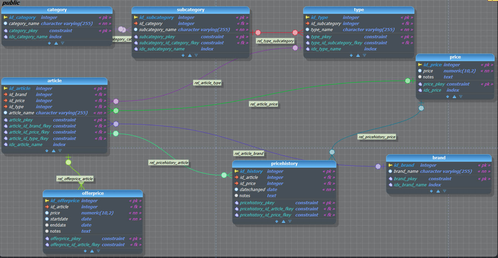

# UnimartScrapping-Analytics

A specialized tool suite designed for the entire data journey of the [Unimart](https://www.unimart.com/) website - from scraping to analytical visualization.

# Table of Contents
- [UnimartScrapping-Analytics](#unimartscrapping-analytics)
- [About Unimart](#about-unimart)
- [Description](#description)
  - [Data Extraction](#1-data-extraction)
  - [Data Analysis & Visualization](#2-data-analysis--visualization)
- [Sample Statistics](#sample-statistics)
  - [Top 10 brands with the most articles](#top-10-brands-with-the-most-articles)
  - [Number of Articles by Subcategory](#number-of-articles-by-subcategory)
  - [Price Statistics by Category](#price-statistics-by-category)
  - [Most Expensive Articles](#top-10-most-expensive-articles)
- [Key Features](#key-features)
  - [Data Extraction](#data-extraction)
  - [Data Analysis & Visualization](#data-analysis--visualization-1)
- [Installation](#installation)
- [Usage](#usage)

## About Unimart

[Unimart](https://www.unimart.com/) is a leading online store in Costa Rica, boasting an extensive offering of over 40,000 products at competitive prices. Authorized to retail products from renowned brands such as Nexxt Solutions, Argom, Xiaomi, Google, Amazon, and more, Unimart has carved its niche primarily in the electronic, computing, home, sports, perfumes sectors, among others. With its expansive product range and commitment to quality, it has established itself as a premier online shopping destination in the region.

## Description

This project is divided into two main phases:

### 1. Data Extraction
This phase involves a web scraper built to navigate the Unimart website [Unimart](https://www.unimart.com/), identify and extract product categories, subcategories, and specific product details such as brand, name, price, and offer price. Extracted data is stored in Excel files, with functionality to upload these files to an Amazon S3 bucket.

- Automated browsing using `selenium`.
- Data extraction structured into categories and subcategories.
- Data storage in Excel files using `openpyxl` and `pandas`.
- Functionality to interact with AWS S3 using `boto3`.

### 2. Data Analysis & Visualization

In this phase, the extracted data from the Excel files is imported into a PostgreSQL database. This database has been meticulously designed for both structured storage and efficient querying, ensuring optimal performance during analysis. By leveraging various analytical techniques, we aim to provide rich visualizations and derive meaningful insights from the Unimart product landscape.

- **Database Model:** The structure and relations within the database are illustrated in the following model:

 

Database design is structured to efficiently store and query information about Unimart products. Here's a brief overview:

	- Category: Stores main product categories.
	- Subcategory: Specific subcategories associated with a main category.
	- Type: Types of products, tied to a specific subcategory.
	- Brand: Product brands.
	- Price: Holds product prices with an optional note field.
	- Article: Specific items. These are linked with a brand, price, and type.
	- PriceHistory: Historical price change records for each item.
	- OfferPrice: Special or offer prices for items, with start and end dates.

Several indices have also been created to enhance query speeds on commonly queried fields such as category names, subcategories, brands, and more. For a detailed and comprehensive view of the schema, you can refer to the [complete script here](resources/database_design.sql).

- **Seamless Database Integration:** The project integrates seamlessly with PostgreSQL using the `psycopg2` library.
- **Comprehensive Database Management:** Beyond mere data storage, the system boasts extensive database management features, from data insertion and queries to other CRUD operations.

## Sample Statistics

To provide a glimpse into the kind of analytical insights this tool can generate, here are a few sample visualizations:

### Top 10 brands with the most articles


### Number of Articles by Subcategory


### Price Statistics by Category
Average, Minimum, and Maximum prices of articles for each main category.


### Top 10 most expensive articles


## Key Features

### Data Extraction
- **Web Browsing Automation:** Uses `selenium` for efficient website navigation.
- **Structured Data Extraction:** Categorizes data into main categories and subcategories.
- **Excel Integration:** Uses `openpyxl` and `pandas` for structured Excel file storage.
- **Amazon S3 Integration:** Comes with `boto3` functionality for storing data in the cloud.

### Data Analysis & Visualization
- **PostgreSQL Integration:** Seamless data management using `psycopg2`.
- **Database Operations:** Comprehensive CRUD functionalities for efficient data handling.
- **Graphical Insights:** Uses `matplotlib` for visual data representation and analysis.

## Installation

1. Ensure you have Python installed on your machine.
2. Clone this repository:

git clone https://github.com/alegambo/UnimartScrapping-Analytics.git


3. Navigate to the project directory:

cd UnimartScrapping-Analytics


4. Install the necessary dependencies using the `requirements.txt` file:

pip install -r requirements.txt


5. Set up your environment for Selenium and the respective WebDriver (e.g., ChromeDriver if you're using Chrome).

6. Configure your AWS credentials if planning to use the S3 functionality.

7. Ensure you have the following folder structure in your "Documents" directory:
```
Documents/
│
└───Excels/
    │
    ├───Articles_by_subcategory/
    │
    ├───MainCategories/
        │
        └───MainCategories_urls_subcategories/
```
8. By default, the code uses the following directory paths:

```python
OUTPUT_DIRECTORY = 'C:\\Users\\alega\\Documents\\Excels\\'  # Directory to store output files
READ_DIRECTORY = 'C:\\Users\\alega\\Documents\\Excels\\Urls\\'
```

If your directory structure is different, or you want to change the location where files are read from or written to, modify the above variables in the code accordingly.


## Usage

### Starting the Scraper (Phase 1)

1. Navigate to the project directory:

```python
cd path_to/UnimartScrapping-Analytics
```

2. Run the scraper script:

```python
python ScrappingUnimart.py
```


This process populates Excel files with the data extracted from Unimart. Please note that the scraping procedure is comprehensive and, given the extensive range of products on the Unimart website, it may take at least 3 hours to complete.

### Starting to Populate Database and get Analytics (Phase 2)

Follow these steps to populate your database and generate analytics from the scraped data:


Before running the script, ensure that you've properly set up the database according to the provided design. 

Also, ensure the correct credentials are set in the script:

```
HOST = 'localhost'
DBNAME = 'unimart'
USER = 'postgres'
PASSWORD = 'root'
PORT = '5432'
```
Modify these values if your database setup has different credentials or connection parameters.

1. Navigate to the project directory:

```python
cd path_to/UnimartScrapping-Analytics
```

2. Run the script:

```python
python DataAnalysisUnimart.py
```

